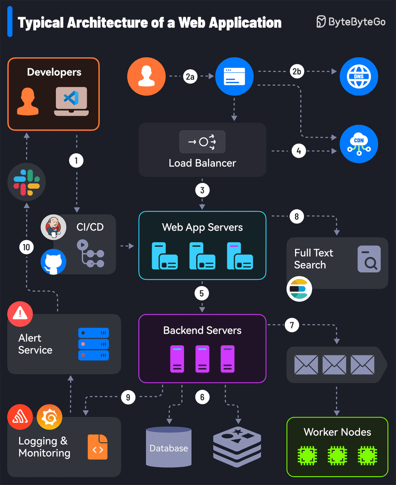
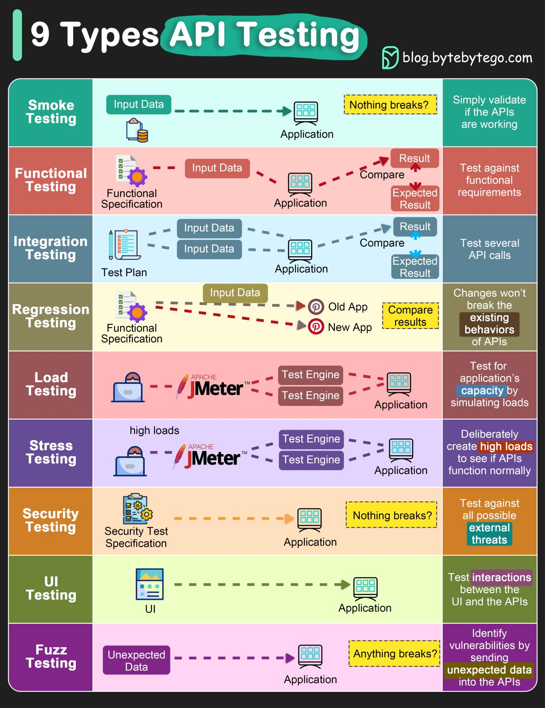

## Eğitim ve roadmap
Artık ürünlerin ,bilgisayar bilimleri veya bilişim mesleklerindeki branşlaşmaların arttığı ve 5-6
sene öncesine nazaran ürünler daha detaylı olduğu bir süreçteyiz(yapay zeka geliştirmeyen kurum
kalmadı) .
Ancak işin başındaki birisi olduğunuzda ,birçok süreci az kişilik ekiplerle yönetmek
zorundasınız[Eğer imkanlarınız varsa her alanın uzmanı ile çalışmak tabiki çok daha iyi].Yapay
zeka ve/veya chatbotlar kullansanız dahi,uçtan uca bir bilgi birikimine sahip olmak
zorundasınız.Elbette mutlaka bir alanda uzmanlığınızın olduğunu varsaymak zorundayım fakat
büyük fotoğrafı çekebilmeniz adına sizler için bir rehber hazırladım.

## Proje Yönetimi ve ihtiyaç analizi

## İhtiyaç analizi
Kurumunuzda iş analisti ,product manager veya bir birim varsa zaten sizleri yönlendirecektir. 
Eğer böyle bir çalışanınız yoksa en azından yazılım geliştirici /üretici mentalitesi ile müşteri ile konuşun.  
Çoğu kurum/kuruluşta  ihtiyaç anlaşılmadan tekme tokat kod yazılıyor.

<h3 style="color:red"> Hiçbir şey yapamıyorsanız,müşteriye ihtiyaçlarını sorun ! </h3>
Yapabileceğiniz en basit ihtiyaç belirleme süreci paylaşayım.

1.  Müşteriye ihtiyaçlarını sorun ve işyerini inceleyin.(Aslen atlanan nokta burası)
2.  Müşterinizin çalıştığı alanı araştırın
3.  Çalıştığınız projenin rakiplerini ve alternatif versiyonlarını araştırın.O üründeki özellikleri yazın.
4.  İleride karşılaşabileceğiniz ihtiyaçlarıda ,ihtiyaç listesine dahil edin.

<b>İhtiyaçlarını iyi belirlediğiniz taktirde işinizin %60'ı hali hazırda bitecektir.!</b>

##  Proje dosyası
Projeleriniz için SDD (software development document) dökümanları hazırlamak sizin için faydalı olacaktır.Çünkü ihtiyaçları ve geliştirilecek yazılım bütün sürecini derleyip toplayarak yazılım geliştirme sürecinizi daha kısa ve kaliteli hale getirecektir.

### Geliştirme ortamı seçimi
Geliştirme ortamı ekibin adaptasyon yeteneğine bağlıdır.Varsayılan olarak ,web servisleri ve web geliştirme sürecini ele alalım.En temel olarak şu soruları sorarak ortalama sağlıklı karar alabilirsiniz. 
1. Ekipteki kişilerin en çok kullandığı front-end frameworkleri
2.  Ekipteki kişilerin en çok kullandığı backend frameworkleri
3. Ekipteki kişilerin en çok kullandığı veritabanı sistemleri  

Büyük sayılar kanunu çoğu zaman işe yarar :) . Ancak anlaşmazlık yada ihtiyaçlara bağlı tercih yapmak isterseniz şu şekilde sizlere kişisel tavsiyelerde bulunabilirim.

#### Frontend framework ve kütüphane Seçimi
1. Eğer statik sayfalara sahipseniz veya az sayfaya sahipseniz :Basit bir bootstrap veya herhangi bir css kütüphanesi ve jquery gibi birkaç  kütüphane sizin işinize gerek kalmayacaktır.Basit ajax requestleriyle veri alıp verebilirsiniz(monolith yapı kurgulayarak)

2. Eğer componentleri ,ekranları yenilenen sürekli yenilenen ve fazla sayfa yapısına sahip çok katmanlı yada birçok servisin bir arada bulunduğu durumda tercihim :svelte framework olur.

#### Backend framework ve kütüphane Seçimi 
Bu tavsiyelerim tamamen kişiler deneyimlerimden ortaya çıkan bir listedir.
1. Eğer oyun geliştirmek isterseniz ve çok fazla asenkron işlem varsa :nodejs-express
2. Eğer analitik bir servis yada microservice geliştiriceksem :FastAPI
3. Eğer basit crud işleri yada ufak bir proje geliştiriceksem:Flask microframework 
kullanmak mantıklı olacaktır.

## Yazılım geliştirme alanı kaynakları
Bir yazılım mimarı & full stack developer olarak yazılım geliştirme alanında geniş bir fotoğraf
çekmek veya eksiklerinizi görmek isterseniz.Bu kaynaklar sizler için oldukça faydalı olacaktır.
1. https://www.youtube.com/watch?v=m8Icp_Cid5o&t=4s
2. https://www.youtube.com/watch?v=F2FmTdLtb_4&t=2600s
3. Master Software Architecure A pracmatic guide -MACIEJ “MJ” jedrzejewski
4. The Self-Taught Programmer_ The Definitive Guide to Programming Professionally-Cory
althoff
5. https://kurumsaljava.com/2009/01/15/bizimalemcom-bir-sistemin-tasarlanis-hikayesi/  uçtan uca bir proje kesinlikle bu bloğu okumalısınız.

6. https://bytebytego.com/guides/the-ultimate-software-architect-knowledge-map/

### Yazılım geliştirme süreci antremanı

Eğer bir junior geliştirici iseniz veya tek alanda çok fazla vakit harcadıysanız şu egzersizi
yapmanızı veya bir proje geliştirmenizi isteyeceğim. Uçtan uca sürecin nasıl bir şey olduğunu
anlamanızda oldukça faydalı olacaktır. 
Not: Dil modeli yada claude falan kullanılmayacak.

1. Yazılımı geliştireceğiniz alanı araştırın.O mesleği yapan insanlarla konuşun.

2. Bir yazılım geliştirme dökümanı hazırlayın.
3. Bir domain ve bir vps satın alın.
4. Bir monolith ,birkaç katmanlı veya birkaç mikroservis geliştirin.
5. Bir webserver kurun
6. Bu servisi webserver’a bağlayın.Domain üzerinden o uygulamanıza erişmeye çalışın.
7. Kendi sunucunuz içerisinde logları inceleyin
8. Testlerinizi yapın .
Buradaki bütün süreci kendiniz işlettiğiniz taktirde ufkunuz açılacaktır.Bu konuda kestirme yol yok
fakat basit bir şekilde kullanabileceğiniz araçları "Kullanılabilecek platformlar ve uygulamalar" bölümünde listeledim.

## Veri Bilimi(Data Science) kaynakları
Veri alanında bilginiz yoksa bile bir veri ile neler yapabileceğiniz hakkında birkaç fikir
edinebilimeniz adına örnek projeler yapan birkaç eğitimi sizlerle paylaşıyorum,.Elinizdeki veriyi
nasıl değerlendirebileceğinizi kestirebilirsiniz.(Tabiki temel seviyede istatistik bilmeniz gereklidir.)
1. https://www.youtube.com/watch?
v=JwSS70SZdyM&list=PLWKjhJtqVAblQe2CCWqV4Zy3LY01Z8aF1
2. https://www.youtube.com/watch?v=o6vbe5G7xNo
3. The Machine Learning Solutions Architect Handbook Practical strategies and best practices
on the ML lifecycle, system design-David ping

Bu alanı ayrıca eklememin sebebi şudur.Gün sonunda müşterileriniz kpi ,roı gibi metriklerle çalışmak isteyecektir.Başka bir örnek olarak e-ticaret firmasında takım lideri olduğunuzu düşünelim.Sepet analizi yaparak ürün çeşitliliğini ve kampanyalarınızı organize edebilirsiniz.Gün sonunda Sizlerinde data scientist veya istatistikçi arkadaşlarınızla iletişim kurmanız gerekecektir.

## DataWarehouse Hazırlama / Veri mühendisliği
Bu aşamada ise temel birkaç noktaya değineceğim buna ek olarak kullanabileceğiniz araçları "Kullanılabilecek platformlar ve uygulamalar" bölümünde yazdım.Burada amacımız  verilerimizi en verimli şekilde toplayıp,temizleyip,kullanabilmektir.
### ETL Süreci 
Etl dediğimiz süreç verilerimizi topladığımız ,işlediğimiz ve kullanıma sunduğumuz bir işlemdir.

 

#### Extract (Çıkarma)
Çıkarma ,verileri web scraping yöntemleri,apilerden, loglardan ,sensörlerden topladığımız vb kaynaklardan veri toplayıp kaydetme sürecidir.
Bu işi yapmanın en kolay yolu bir cronjob oluşturup ,bir python scripti çalıştırıp sürekli veriyi kaydetmektedir.

Verileri analitik seviyede kullanmak  için ise postresql ,clickhouse kullanabilirsiniz.
#### Transform (Dönüştürme)
Çıkarılan veriyi kaydederken veya bir client ile veriyi temizlik aşamasına ve düzenli bir forma sokulur.Yapılan klasik işlemler
1. Gelen verinin formatının düzenlenmesi ,Örneğin gelen verinin tarihi düzenlenir ve/veya kaydetme tarihi eklenir(YYYY-MD-DD)
2. Gelen verinin ascii veya sanskritçe  vb ifadelerden  temizlenmesi.

#### Load (Yükleme)
Bu aşamada verileri kullanacağımız aşamadır.Raporlama içinmi ,veri analitiği içinmi yoksa bir makine öğrenmesi modeli eğitmek içinmi kullanacağınız o sizin ihtiyacınıza bağlı.Hazırladığım veriyi yüklediğimiz aşamaya load(yükleme )
 aşaması diyoruz.

## Kullanılabilecek platformlar ve uygulamalar
Eğer web geliştirme yapıyorsanız veya web servisleri geliştiriyorsanız.Ufak ekip ve bütçeye sahip
iseniz.Şimdi ihtiyacınız olabilecek araçları listeleyerek ,birçok şeyi ön görmenize gerek
kalmadan,açık kaynak araçları ,en ucuz maliyetli bir şekilde öğrenebileceksiniz. Müşterileriniz ve
takımınız için daha önce kullanıp tavsiye edebileceğim ürünleri sizler için listeledim.
### Müşteri/Kullanıcı destek
Rustdesk adında açık kaynak yazılım kullanarak,vps sunucunuza bu altyapıyı
kurarak,anydesk,teamwiewer gibi yazılımlara alternatif olarak sınırsız şekilde kullanabilirsiniz.
1. https://rustdesk.com/
### İş/Proje yönetimi
Proje yönetimi için jira vb projeler yerine taiga kullanarak ,ister vps’siniz üzerine kurabilir veya
taiga.io üzerinden kullanabilirsiniz.
1. https://taiga.io/

### Webservisler ve proxyler
#### Webservisler için reverse proxy
Eğer milyonlarca requesti bir anda yönetmeyecekseniz(muhtemelen yönetmeyeceksiniz) .Caddy kullanmak oldukça iyi bir opsiyondur çünkü
1. Otomatik olarak certbot ile otomatik olarak ssl kurulumu yapar
2. Caddy çok daha basit bir konfigürasyon yapısına sahiptir
3. HTTP/2 ve HTTP3 desteğine sahiptir ancak caddyde HTTP/3  desteği varsayılan olarak gelir.

https://caddyserver.com/

#### Proxy
Eğer kapalı vpn kurmak yerine parola koruması ile bir proxy kurmak isterseniz ve basit bir yapı lazım ise squid proxy tam sizler için tls'de takılmıyor ,kurulumda kafa ağrıtmıyor.(Örneğin mitm proxy kullandığınızda tls'de takılıyor.)

https://www.squid-cache.org/

### Versiyon kontrol sistemi
Eğer ekibiniz acemi veya versiyon kontrol sistemine kafa yormak istemiyorsanız,githubta bir organizasyon açmanız daha sağlıklı olur.Ek olarak github workflow ve entegrasyonlarla sürecinizi daha rahat yönetebilirsiniz.

#### Birkaç tavsiye
1. Githubta dependabot ile ücretsiz bir şekilde otomatik olarak paketlerin güncellenmesini ve bilinen açıkları kontrol edebilirsiniz.

2. Opencode kurulumu yaparak ücretsiz şekilde kurallar ve issue yönetimi yapabilirsiniz.

### Api/endpoint dökümantasyonu
Platform bağımsız kesinlikle swagger eklentisi kullanın.Teşekkür ediceksiniz(not:ürüne çıkarken kapatmayı unutmayın)

### Mail sistemi
Eğer müşterilerinize mail sistemi kurmak isterseniz veya kendi sunucunuzda mail servisi  deploy etmek isterseniz  ve mail adminliği tecrübeniz yoksa modoboa sizler için birebir.Ek olarak docker tabanlı mailcow'da kullanabilirsiniz.
1. https://modoboa.org/en/
2. https://mailcow.email/

 ### Monitoring sistemi
Sunucu tarafında kaynaklarınız kıt ise beszel ancak kaynaklarınız fazla ise zabbix kullanabilirsiniz.
Hem bare metal hem docker tabanlı olarak  agentlarınızı rahatlıkla kurabilirsiniz.Gün sonunda kaynaklarınızı gözlemlemek ve sunucularınızda sorun olduğu taktirde alert sistemini devreye sokabilirsiniz.

1. https://beszel.dev/guide/hub-installation

#### Application monitoring & Tracing
##### Tracing
Bu süreçte ise atılacak her bir requestin hangi süreçte ne kadar süreyle devam ettiğini görebiliriz.
https://github.com/jaegertracing/jaeger-ui
### Load balance & Cache

 ###  Test sistemleri

Elbette yazılım geliştirme aşamasında ,test yazmak ve/veya  bunun için vakit harcamak oldukça can sıkıcı farkındayım.Eğer test konusunda tembellik yapmak isterseniz en azından google lighthouse eklentisi kullanın.(Temel seviyede bir web uygulamasındaki gerekli kriterleri ve eksikliklerinizi raporlayacaktır)

1. https://chromewebstore.google.com/detail/lighthouse/blipmdconlkpinefehnmjammfjpmpbjk
2. Kullandığınız programın test framework'üne göre unit test yazabilirsiniz.

### CPU & Memory Flame Graphs

 ### Güvenlik 
İşte şimdi işin rengi oldukça değişecektir.Hiçbir zaman yatırımın yeterli olmadığı ancak çoğu kurumun veya kişinin yetişemediği bir alan ,ancak basit ve etkili birkaç tavsiye verebilirim.

    1. Sürekli yedek tutun .
    2. Firewall(ufw) kurulumu yapın.
    3. Cloudflare yapılandırması(ücretsiz versiyonu startuplar için yeterli olacaktır)
    4. Olabildiğince ufak araçlar ile yönetilebilir sistemler oluşturun.Kompleks yapılardan kaçının.
    5. Kullandığınız kütüphaneler ve altyapılar güncel olsun.

Bundan sonrası zaten güvenlik ekibinin (blue team'in ) işi.
       

 ### Diagramlar ve planlama sistemleri
Draw.io kullanarak planlama için c4model ve/veya uml diagramları çizmek için kullanabilirsiniz.

1. https://www.drawio.com/

 ### IOT & Elektronik ihtiyaçlar
Eğer elektronikte acemi iseniz.Sensörlerle ilgili ihtiyaçlarınız mevcutsa esp32  ancak işletim sistemine sahip bir elektronik cihaz lazım ise rasberyy-pi  kullanabilirsiniz.Maliyet ve kullanım açısındanda acemiler için uygun.

Eğer işletim sistemine sahip iot cihazınız varsa , ssh tarafındada kopukluklar yaşarsanız .Modemden port açıp cockpit ile linux tabanlı cihazını yönetebilirsiniz.

1. Cockpit 
https://cockpit-project.org/

# Kaynakça
    1. https://newsletter.pragmaticengineer.com/p/thriving-as-a-founding-engineer
    2. https://hypernestlabs.com/guides/hiring-founding-engineers-guide
    3. https://40226375.fs1.hubspotusercontent-na1.net/hubfs/40226375/Founding%20Engineer%20Guide.pdf
    4. https://www.getclera.com/blog/the-complete-interview-guide-for-founding-engineers-at-ai-startups
    5. https://www.quora.com/What-does-it-mean-to-be-a-founding-engineer
    6. https://www.paraform.com/blog/what-is-a-founding-engineer
    7. https://userjot.com/blog/caddy-reverse-proxy-nginx-alternative

    8. https://rihab-feki.medium.com/building-a-modern-data-warehouse-from-scratch-d18d346a7118

    9. https://www.linkedin.com/pulse/ihtiya%C3%A7-analizi-kim-i%C3%A7in-ne-%C3%BCretmeli-fatih-candan-5kobf/

    10.https://bytebytego.com/guides/the-ultimate-software-architect-knowledge-map/